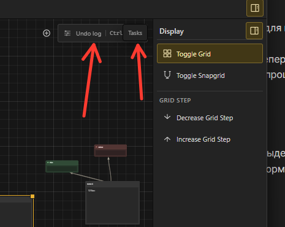
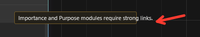
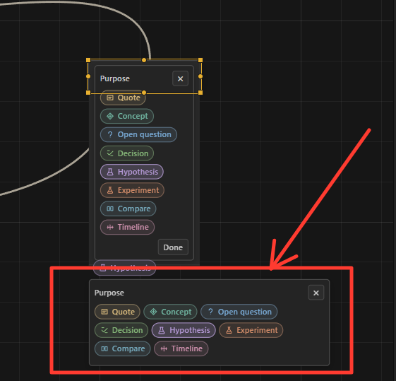

дебаг:
1. если у меня не выбрана нода заранее и в ней нет текста, мне надо вместо 2 раза для ввода нажать 4.
2. сделай ундо лог под таском, когда разрываешь таск, ундо лог уходит под разрытое окно таск

3. сделай рамочку importance в раза так 4-5 жирнее
4. когда я пытаюсь вытащить из текстовой ноды importance, то у меня при зажатии лкм происходит выделе, и вместо перетаскивания у меня все начинает выделятся
5. когда я нажимаю на кнопку "basic" чтобы выбрать импортанс, у меня вылетает меню с ним, все круто и класно, но есть одно НО - я не могу закрыть его обратно, если я тыкну ещё раз на бейсик у меня ничего не произойдет, мне надо обязательно что-то выбрать чтобы его закрыть, что невероятно неудобно, так что сделай чтобы можно было просто нажать на тег и меню с выбором закрывалось бы. это касается так же и purpose
6. когда я добавляю ноду через пкм, пусть всегда их связывает линия curve (base) а то сейчас там то зигзаги то ещё что-то (я думаю что это зависит от моего последнего выбора) ну короче сделай на вот таким образом созданным нодам соединение только через curve (base)
7. сделай разделение по рядам чтобы ряд где стоит importance и ряд где будут purpose были разделены небольшой линией, типо сверху importance снизу purpose чтобы они вмести не стояли и не сливались.
8. почему тулл тип вылетает за рамки бокса сообщения? исправь 

9. почему когда я тяну обычную линию (не в пунктир) она у меня в превью протяга пунктирная? пусть будет обычной даже когда я ещё её тяну
10. я вытащил purpose из ноды и нажала на сам purpose у меня вылетела менюшка, и она сделал почти хорошо но есть 2 но: 

    1. что это вообще такое? почему интерфейс продублировался ниже и стал горизонательным убери это вообще, и 2. почему квадрат выделений не изменил размеры. все тоже самое касаетсяи importance

имрувмент:
1. в режиме линий если я зажимаю лкм на пустой точке то у меня начинается зона выделения, где я могу выбирать линии и дальше с ними взаимодействовать (удалить или поменять форму)
2. я понял что нет смысла в существовании ровной линии (самой первой), так что теперь вместо 5 линий будет 4 линии: curved (переименовывается в base), Orthogonal, zigzag, wave. проще говоря меняем straight на curve (ныне уже base)
3. если не тяжело сделай сейчас, если - да то потом но запиши туда чтобы потом об это вспомнить, так вот: сделай анимацию absolute чтобы градиент переливался, а так же добавь настройку в настройки программы (блииин я ток заметил что их у нас пока нету хахах, ну когда добавятся добавь туда галочку а пока сделай это (если сделаешь)) галочку которая минимизиуерт все анимации в том числе и эту

новая идея:
1. новая нода по типу purpose и importance, называется Mood, работает абсолютно так же как и выше перечисленные ноды, вставляет в таск/обычную ноду и описывает настроение сообщение. пока придумал такие: anger, Happiness, Sadness, disgust, fear, Surprise, Joy, Love, Excitement, Gratitude, Pride, envy, guilt, shame, jealousy, disappointment, confusion, curiosity, boredom, relief. придумай каждому настроению цвет (только блять прошу не добавляй стикеры) ну и как purpose можно добавлять несколько на одну ножу, а так же как и в 7 дебаге я писал они будут разделены с purpose и importance. будут идти так: 1 importance 2 purpose 3 mood.

примечение:
визуализация тасков выглядит ужасно с точки зрения дизайна но работает так что пока не трогаем