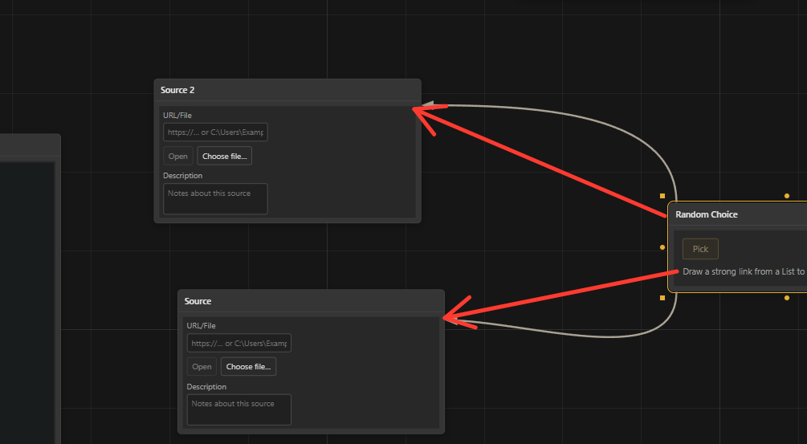

почти всех сделаного плохо из дебага
так что вот дебаг на дебаг на дебаг:
1. mark as - почему плюсик сместился в зону где менять цвета, тег и тд? плюск должен быть сверху и стоят справа от добавленых тегов и его нельзя скрыть он будет всегда виден в отличии от остальных кнопок, так же почему галочка frame появляется когда я засовую ноду mark as в другую ноду.
2. mark as - почему я не могу нажать на галочку фрейм пока не создал тег? он должна включатся сразу и активировать фрейм когда есть уже какие-то теги. так же ты меня не до конца понял, фрейм показыватеся только на ноде в которой mark as или к ноде к которой подключен mark as на самой ноде рамочки нету
3. 

smooth lines - все работает замечательно, но почему как по мне оно не выбирается самый оптимальный путь к ноде? почему именно такая форма линий как на скриншоте? по ощущением smooth lines по какой-то причине не могут идти с бока ноды, только сверхней стороны что странно
4. бинд на inbox ноде немного сломан, точнее я мне пишет ошибку в настройках что из-за какой-то программы бинд не работает, а ты можешь сделать так чтобы он забивал на чужие бинды и работали нормально.
5.  я не могу нормально поменять бинд в настройках, и когда нажимаю на бинд и пытаюсь ввести свой новый бинд то оно не реагирует и не вводит новый бинд, так что сейчас поменять бинд нельзя. 
6. отсупы 5-15 работают криво, точнее само число отпустов окей. но внесу правки в логику:
    1. сейчас по какой-то причине ноды идут только на искосок, возможно ты меня не правильно понял, они помгу появлятся и сбоку, точнее я напишу так: минимальный фактор по ширине = от -5 до 5 максимальный фактор от -15 до 15. а так же пусть ноды создаются максимально близко к условной ноде inbox, то если есть место и нода может создается рядом то она создается по ближе к условному inbox. ВАЖНОЕ УТОЧНЕНИЕ: когда я говорил по ближе создется это касается не разброса -15 - 15, это касается создания кратного разброса, например если рядом с inbox есть одна нода, то вторая нода не может создатся рядом с нодой которая подключена к инбоксу, новая нода создатся просто в другой стороне рядом, учитывая разброс от -15 до 15 по высоте и ширине
7. я по прежнему не могу добавить ноду statistics прямо в ноду list. точнее могу но совсем не так как я хотел, если я перетаскиваю ноду statics вручную на ноду list то появляется некий экстеншен-нарост в котором теперь напротив рядов list пишется статистика. statistic становится вставной нодой как mood, purpose, importance, mark as. и если ты зажмешь лкм на пустой части этого экстеншена или просто по верхней части ноды в зоне наросат-экстеншена то ты сможешь её вынуть из ноды list 