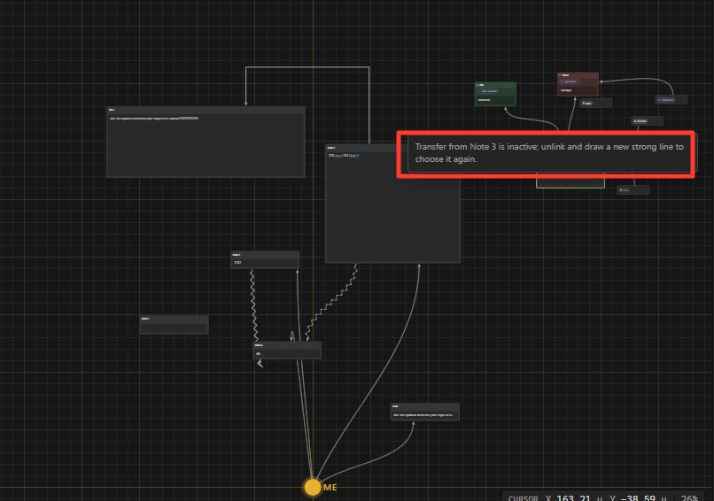

дебаг
1. радужная анимация вокруг absolute очень плохо сделана и она обрывистая, пусть она будет цикличной а то там проходит цикл и оно ломается и выглядит не прикольно
2. mood я почему-то не могу вставить в ноду так же как importance и purpose. точнее я мог её создать прямо в ноже и все будет ок, но если я вытащил mood то обратно засунуть не могу
3. когда я тыкаю по вынутой ноде purpose, importance, mood пусть у меня с первого клика открывается список всего что там есть если я нажимаю на тег, а то сейчас мне надо нажать 3 раза подряд чтобы сначала нода выделилась а потом лишь я смогу нажать на тег чтобы его раскрыть.
4. если у меня вытащены mood/purpos когда я открываю я не хочу чтобы при выборе сразу закрывалась менюшка, а то когда они в ноде все ок, а когда вытащены я открываю список, выбираю допустим что-то и у меня сразу закрывается менюшка, это не удобно так как может я сразу хочу выбрать несколько (не касается importance так как выбрать там можно только одно положение)
5. если я сейчас попытаюсь провести пунктирную линию от purpose/mode/importance то у меня вылетит ошибка что можно только сильными линиями. сделай так чтобы вместо ошибки ставился просто сильная линия если даже я сейчас в режиме пунктира (при этом не переключай режим, я продолжаю быть в режиме пунктира)
6. если я в таск ноду провел обычну ноду и заменил текст таск ноды на текст обычной ноды, ты при разрыве линии текст который был изначально в таск ноде (если он был) должен вернутся
7. когда я провожу сильную линию к таск ноде с обычной ноды и говорю чтобы программа не заменяла текст, у меня вылетает предупредительное окно, только есть проблема в том что это окно никак не закрывается, оно продолжает висеть вечно, пусть оно пропадает через 3 секунды,  и в целом сделай так что оно так показывается 5 раз а после 5 подсказки больше никогда не появляется. 

а так же пусть этот совет вылетает возле таск ноды и имеет фиксированный размер, а то он огромный и мешает экрану.

импрувмент:
1. сделай так что ноды по типу importance, purpose, mood я не мог скейлить больше чем в 2 раза от их базового размера по высоте, в ширь скейлить вообще нельзя