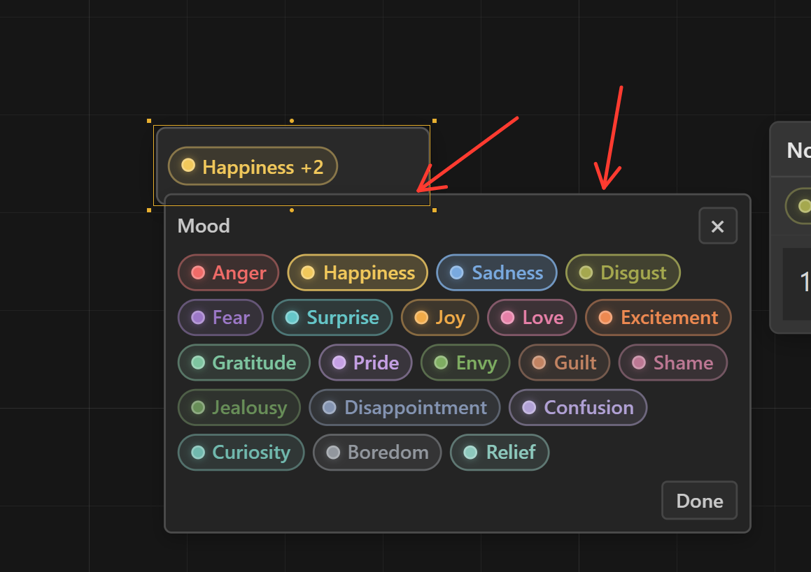
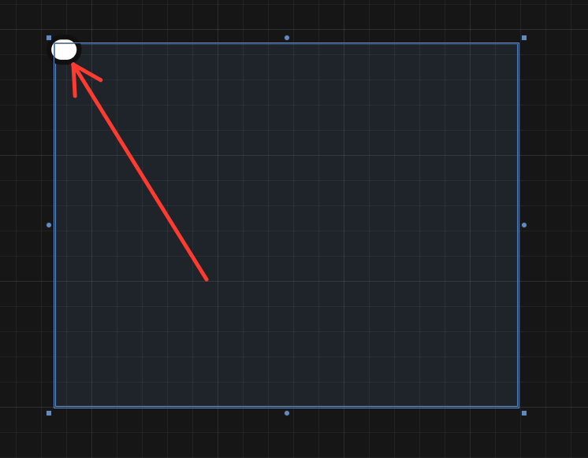
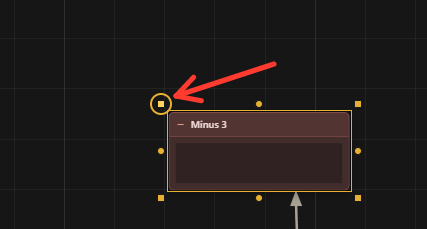

дебаг:
1. убери подсказку когда 

импрувмент:
1. добавь механику замка на ноду, что ноду нельзя расширять в ширину, а так же обычную ноду нельзя расширить больше чем в 2.5 раза от базы по ширине, и больше чем в 1.5 раза по высоте если там не достаточно текста, то если в ноде 2 строки то она может разширится примерно ещё на 5 строк там будет сказать точнее, а если будет 100 строк то тоже ещё на 5 может, но прямого лимита нету если нафигачить строк
2. перебиндь поиск на ctrl+t а то он сейчас конфликтует с извинением формата линии
3. mark beacon на ctrl+m так же сделай опцией в меню когда ты нажимаешь пкм по маяку
4. focus на ctrl+g так же сделай опцией в меню когда ты нажимаешь пкм по маяку
5. убери вариант с меню которое открывается пкм по маяку "mark as task"
6. улучши поиск, чтобы когда я писал beacon то у меня показывались маяки даже если маяк называется не beacon
7. когда я добавляю ноду mood, она у меня сразу стает happiness, пусть при добавление она будет подписана просто mood 
8. 

открывающаяся панель когда ты раскрываешь ноду Mood/purpose/importance то она налазит на саму ноду, сделай чтобы она открывалась чуть по дальше
9. когда ты закрепляешь меню которое открывается при нажати Q то ноды начинают ставится не в той точке где ты открыл меню а в центре экрана
10. для нод purpes/mood/importance есть исключение в выделении маяка, обычное при ctrl+g у тебя выделяется только маяк и его перенты и перенты перентов. но я хочу сделать исключение что purpes/mood/importance могут является независимыми нодами которые являются перентами для нод из маяк то они тоже берутся в сеть маяка, при этом если ноды purpes/mood/importance подключены ещё перентом для ноды которая не является связаной с маяком то она не подсвечивается при фокусе маяка 
11. выделение является действие для redo/undo, это работает как в блендере, что в бледере выделение считается как действие которое можно отменить, я хочу так же
12. что это? почему когда я нажимаю в левый верзний угол зоны у меня появляется эта клякса, удали.

13. почему когда я нажимаю на точки выделения и я нажимаю кнопку C и тогда у меня происходит что-то странное чего быть не дожно, я щас кину тебе пару скринов 

1. первый легкий дизайн импрвумент: удали полностью. панельку справа с toggle grid, toggle snap, decrease grid, increase greed. 
    2.1 - заменить кнопку grid по центру на иконку магнита, я кинул 2 иконки когда он включен и когда  он выключен. в целом кнопка выглядит как не большой квадратик с закругленными углами в котором магнит, в нутри квадрат на пол тона отличается цветом серого от панели, а когда магнит включен то квадрат заливается желтым цветом (как тема программы)
    2.2 - удалить справа от центральной кнопки grid пиксели и кнопку snap.
    2.3 - сделай справа от магнита небольшую разворачивающуюся стрелочку, он так же будет в квадрате, и так же будет гореть желтым когда развернута (ну и мини анимация её разворачивания) когда ты её разворачиваешь там будет 2 вещи пока:
        1. grid (on/off)
        2. grid step (поменяй ему визуал, теперь это просто будет одна полоска с цифрой, и если ты нажимаешь на полоску то размер грида меняется, если ткнешь после числа 100 то грид сбросится до 5, если нажимать не лкм а пкм то счетчик будет идти в обратную сторону)

а и я забыл уточнить, переключение магнита не включаее/выключает грид, он переключает snap, а грид переключать и отключать теперь в выпадающем окне со стрелочки.

3 - добавь функцию что если у меня стоят условно mood - sadness и mood - happiness то я мог их объеденить в одну ноду. если у меня допусти есть нода и с happiness и с sadness а я хочу её объеденить с нодой sadness и guilt то при соединении пропадет один из sadness и получится - guilt, sadness, happiness. тоже самое работает и purpose 
4 - небольшой дизайн импрувмент, пусть квадрат выделение плавно огибает контуры ноды а не является четким квадратом
5 - редизайн нод purpose/mood - при поставке ноды у тебя есть просто подпись mood (или же Purpose но конкретно сейчас я разбираю вариант с mood) и ты по ней жмешь то у тебя вылетает меню с вариантами, как только ты берешь один из вариантов то надпись mood пропадает (это не касается purpose). после у тебя появляется + в кружке справа от последнего добавленой причины/настроения, если ты на него нажимаешь как раз таки вылетает менюшка, если ты выбираешь что-то из менюшки то оно пропадает и летит в строку выбраного, если нажать лкм с открой менюшкой по настроени/причине то оно вернется в менюшку выбора. А ТАК ЖЕ самое главное, есть полная визуализация когда нода стоит отдельно, а то сейчас в настроении там пишется happiness+2 а надо чтобы писалось все
6 - несколько нод не могут быть поставлены в одной точке, если ты ставишь одну ноду а за тем в ту же точку другую то она выталкивается ставится рядом