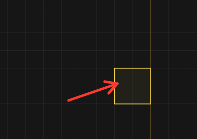

дебаг:
1. 

при запуске программы у меня в любом режиме теперь следует кисть рисования зон (квадрат), короче баг чистым видом.
2. сделать так что я могу двигать зону лишь при 2 условия: 1. в режиме редактирования зон я нажал G наводясь на зону 2. нажал пкм по зоне и там вариант "двигать зону" и тогда у тебя включается режим двиганья и тогда ты можешь двигать зону как обычную ноду, чтобы закончить надо нажать enter или тыкнуть пкм, или переключится в другой режим.  
3. удали функцию что на shift убирается грид с рисования зон, грид для зон должен быть всегда.
4. когда в режиме редактирования зон ты нажимаешь shift ты переключаешься в режим двиганья зон, и вместо рисования ты можешь двигать зоны 
5. если в goal ноде у меня путь выглядит так: таск1-таск2-goal таск3-goal, то есть напрямую с goal связана только таск2 и таск 3, но так же существует таск1, и он является субтаском для таск2, пусть на ноде goal снизу под task 0/2 пишется так же subtask 0/1
6. сделай рамку свечения у goal в 2 раза толще (само свечение не трогай)
7. убери механику что я не могу тегнуть таск как выполненый если перед ним стоит другой таск
8. добавь в ноду statistic и progress самый вырехний выбор в окне с выбором режиме (source). эта механика уже есть и она работает на отлично, но если я переключусь на какой-то из варианто и захочу чтобы обратно ноды считали то что находится под ней то я не могу вернутся, для этого и добавь этот вариант выбора.
9. сделай исключение для statistic и progress, они могут идти в маяк по линиям, по умолчанию в маяк ни одна нода не может войти, а эти 2 смогут, тем самым когда ты их подключашь они берут за scope этот маяк (и тогда ещё зоне где написано что за scope замораживается и нельзя открыть список, пока не разорвешь линию)
10. когда я нажал пкм на зону у меня вылетает менюшка где можно перейминовать зону и покрасить, но эта менюшка не пропад если я не выберу что-то или не перейминуй, сделай так что если я совершаю любой клик в любую точку по мимо вылетевшей нянюшки то она закрывается. 
11. сделай так что все вылетающие менюшки по типу: q menu, пкм менюшки и вообще все подобнее крепилось не к монитору а к точке где я его открыл, просто это сейчас так работает: я открыл меню и я свиднул камеру и меню двигается с камерой, а я хочу чтобы оно оставалось на том же месте в том же скейле как я его и открыл
